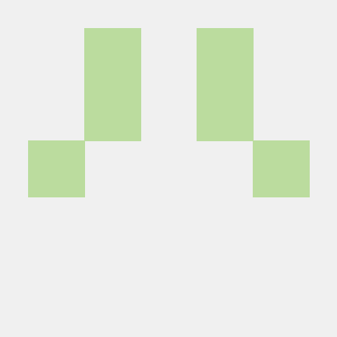

<p align="center">
    
</p>

<h4 align="center">Sejik's NLP Framework</h4>

<p align="center">
    <a href='https://nlp-docs.readthedocs.io/en/latest'>
        
    </a>
    <a href='https://travis-ci.org/Sejik/NLP'>
        
    </a>
    <a href="https://github.com/ambv/black">
        
    </a>
    <a href="https://codecov.io/gh/Sejik/NLP">
        
    </a>
</p>

---

# NLP
**NLP** design principle is based on [CLaf](https://github.com/naver/claf)

## Table of Contents
- [Installation](#installation) 
    - [Requirements](#requirements)
    - [Install via pip](#install-via-pip)
- [Overview](#overview)
- [Experiment](#experiment)
    - [Features](#features)
    - [Usage](#usage)
        - [Training](#training) 
        - [Evaluate](#evaluate) 
        - [Predict](#predict) 
        - [Docker Images](#docker-images)
- [Machine](#machine)
- [Contributing](#contributing)
- [Maintainers](#maintainers)
- [Citing](#citing)
- [License](#license)
    
## Installation

### Requirements

### Install via pip

## Overview

## Experiment

### Features

### Parameters

### Usage
python train.py
    input : 
    output : 
python eval.py
python predict.py

#### Training

#### Evaluate

#### PRedict

#### Docker Images

## Machine

## Contributing

Contributing(Bug, Changes) by Pull Request
Contributing(Framework) by Issue


## Machine

## Maintainers
NLP is currently maintained by 

- [Sejik Park](https://github.com/Sejik)
    
## Citing
    
## Acknowledgements

## License

MIT license

```
Copyright (c) 2019-present Sejik Park.

Permission is hereby granted, free of charge, to any person obtaining a copy 
of this software and associated documentation files (the "Software"), to deal 
in the Software without restriction, including without limitation the rights 
to use, copy, modify, merge, publish, distribute, sublicense, and/or sell 
copies of the Software, and to permit persons to whom the Software is 
furnished to do so, subject to the following conditions:

The above copyright notice and this permission notice shall be included in all 
copies or substantial portions of the Software.

THE SOFTWARE IS PROVIDED "AS IS", WITHOUT WARRANTY OF ANY KIND, EXPRESS OR 
IMPLIED, INCLUDING BUT NOT LIMITED TO THE WARRANTIES OF MERCHANTABILITY, 
FITNESS FOR A PARTICULAR PURPOSE AND NONINFRINGEMENT. IN NO EVENT SHALL THE 
AUTHORS OR COPYRIGHT HOLDERS BE LIABLE FOR ANY CLAIM, DAMAGES OR OTHER 
LIABILITY, WHETHER IN AN ACTION OF CONTRACT, TORT OR OTHERWISE, ARISING FROM, 
OUT OF OR IN CONNECTION WITH THE SOFTWARE OR THE USE OR OTHER DEALINGS IN THE 
SOFTWARE.
```
